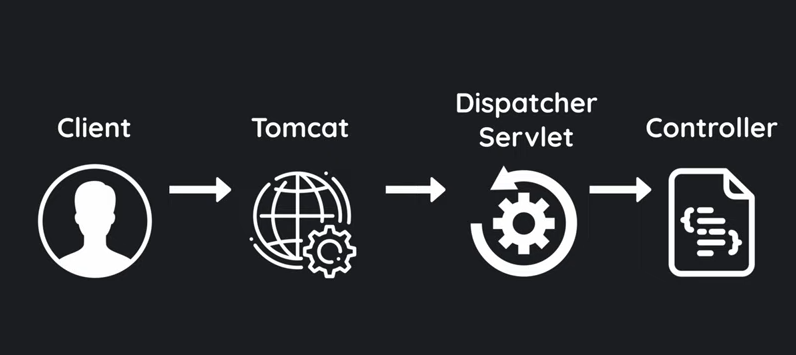
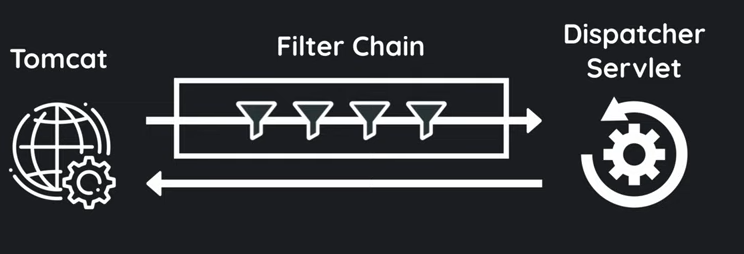
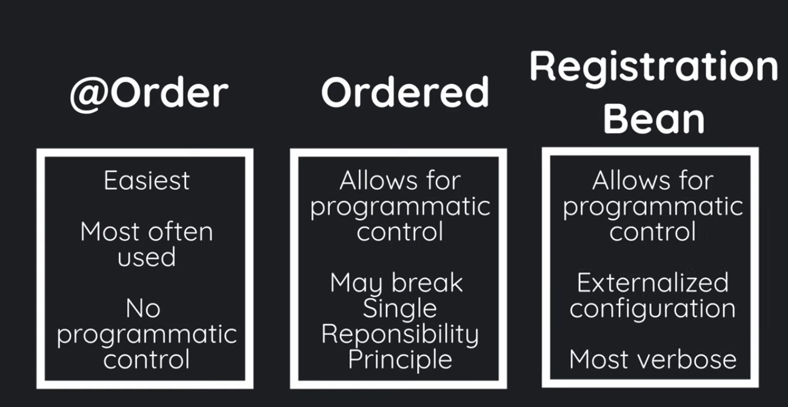

# Writing Middleware in Spring (Filter Chain and Its Techniques) 

-----
## How  Spring works



- client 
- tomcat (in java we called container)
- dispatcher servlet ( main servlet of spring)
- controller (our fav @Controller)

**filter can be multiple**


 filter chain is a group of filter this chain can be multiple too.

----

# Using Filter interface

***Filter : Java class but spring interface ( jarkata.servlet.Filter)***

As this is a JarkataEE class,we need to cast the request just in the way of jarkataEE.Like :

```java

import jakarta.servlet.FilterChain;
import jakarta.servlet.ServletRequest;
import jakarta.servlet.ServletResponse;
import jakarta.servlet.http.HttpServletRequest;
import org.springframework.stereotype.Component;
import jakarta.servlet.Filter;

@Component
public class TestFilter implements Filter {
    @Override
    public void doFilter(ServletRequest request, ServletResponse response, FilterChain chain) {
        // this is how to cast J2EE
        HttpServletRequest check = (HttpServletRequest) request;
        chain.doFilter(check,response);//exit point.
    }
}

```

### Why JarkataEE ? 
The older spring 2 use javax but in this version 3.4.+ or 3.+ ,they use jarkataEE.

> ## Note : 
> have to use @Component to be scanned by your Spring boot main class to be executed.
> This technique can be executed multiple time if we have  2 or more requests.

> ***Meaning : this method is not guarantee  to execute per request and it will have more complexity.***

Filter is a web servlet container concept in every app.
Executes this class before the res reach the controller or any main app code.
The request reach the controller if the filter allows it to go.

### Allows the request and response with 
```
    chain.doFilter(req,res) //This is the release point for res and response
```
This will pass to the controller layers.

## Using OncePerRequestFilter class ( spring class )
 This class guarantee to be executed per request so there is not memory leak.
The implementation is the same way as Filter interface but **use extends** because it is spring **CLASS**

## Calling api with curl in cmd

```shell

curl localhost:8080/
```

----

# Order of filter chain

It has multiple way to set Order


- **Using @Order(int or LOWEST_PRECEDENCE OR HIGHEST_PRECEDENCE)**
    
    > #### Downside : cannot handle dynamic or programmatically
  

- **Using Ordered interface**


- Using Bean (externalize or delegation or delegatedFilterProxy technique)

----

## checking the order of filter

Go to the ApplicationFilterChain.java class which is the filter chain provided by tomcat out of the box
you will see some code like if (pos < n).
 - mark as break point
 - run in debug mode 
 - in console you will see a list of filter chain

> ## Note :
> the filter with a name Websocket must be lowest presendence because the connection must always be make after filter chain process ( concept of middleware).

## Set Order of Filter with Order annotation

This is the easiest way to write and very fast
This annotation is class level so you have to write just after the @Component 

Usage :

```java
 import jakarta.servlet.FilterChain;
import jakarta.servlet.http.HttpServletRequest;
import jakarta.servlet.http.HttpServletResponse;
import org.slf4j.LoggerFactory;
import org.springframework.core.Ordered;
import org.springframework.stereotype.Component;
import org.springframework.web.filter.OncePerRequestFilter;
import someThing;

@Component
@Order(
        //Ordered.HIGHEST_PRECEDENCE
        Ordered.LOWEST_PRECEDENCE
)
public class CustomFilter extends OncePerRequestFilter {
    //manual way to write logger
    private final static Logger log = LoggerFactory.getLogger(CustomFilter.class);

    @Override
    public void doFilter(HttpServletRequest request, HttpServletResponse response, FilterChain chain) {
        log.info("Passed the CustomFilter");
        chain.doFilter(request,response);
    }
}

``` 
> ## Note : 
> **@Order parameter** 
> 
> ***Counting : ( highest... -1 0 1 2 ... lowest )***

# Set Order Of filter with Ordered Interface 

This is techique can be called hybrid techique ( using @Order in just one filter class and  )

Steps : 
- set One Filter class with known `@Order` with annotation


- for the other filters class , implements the `Ordered` interface.
  `Ordered` interface has only one method called `getOrder()` so `Override` as needed.
> ## DownSide : 
> **This techqiue is too much busy for filters beacuse the filter has to think of its rank or order and it also has to filter some logic**

-----

# Set Order Of Filter with Bean ( externalize the rank processing)

In this method, we don't need to implements the `Ordered` interface.
Instead,we move that setOrder to `Configuration` class or `Application` class ( main class ).

>  **Note** :
> `Componement` are spring managed Bean so any function that use that
>  Component we don't need to inject dependency just write the parameter 
>  with that Component datatype,spring will auto inject it.


Steps :

- remove all the `implements Ordered` in Filter Component and also remove the `@Override setOrder`

- create `Bean` in Main class or Application class with return type `FilterRegistrationBean<T>`

- customize url,rank,header and so on..

- see alos in my main class and in filter package


> # YouTub : 
> check this playlist:
> https://youtu.be/DRIo8QNhidk?si=nVmCLX2P_YXVfMIa

